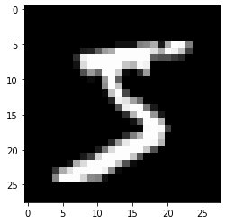

# TRANSFORMER_cuda

Vit-Transformer for the MNIST dataset.

**Author:** Diego Hidalgo

## Features
- `Tensor\`: Own tensor implementation.
- `Layer\`: Layer implementation, containing weights, bias, etc.
- `Transformer\`: CLS, MHA, Layer Norm, classification head, etc.
- `Data Loader\`: Data loader with normalization for MNIST.

## Dataset Image
